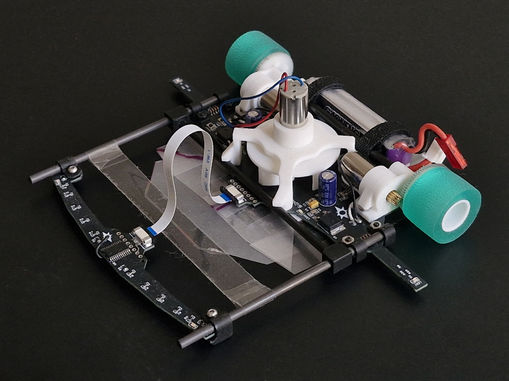

# EVA-RT
EVA-RT es nueva serie de robotracers con impeller centrifugo y sensores laterales para marcas. Creado en diciembre de 2024 para participar en la All Chile robot Contest 2025, obteniendo buenos resultados a pesar de su simplicidad.

Logros obtenidos:

ACRC2025 - 1er y 2do lugar

# HARDWARE
- ATMEGA328P-AU
- GNB LiPo Battery 2S 7.4V 300mAh 60C-120C
- 3x DC Coreless 1020 7.4V
- IFX9201SG
- 12x QRE1113GR line sensor
- 2x QRE1113GR mark sensors
- Ruedas de rodillos para impresora
- Peso: 89gr

# ENTORNOS DE DESARROLLO
- Arduino IDE 2.0.2
- Autodesk Fusion 360
- EasyEDA-ProV2.2.34.8
