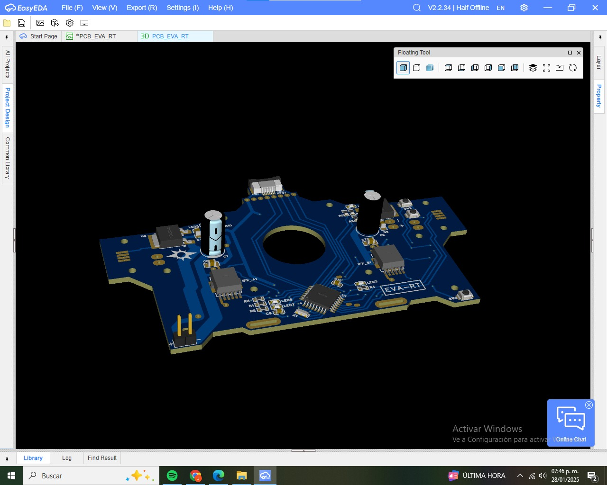

# EVA-RT
EVA-RT is the new robotracer series with centrifugal fan and side sensors for curve and goal marks. Created in December 2024 to participate in the All Chile robot Contest 2025, obtaining good results despite its simplicity.

Achievements:
- ACRC2025 - 1st and 2nd place

This repository contains the source code, 3D models, details and PCB files of the robot.

# DETAILS
- Name: EVA-RT
- Dimensions: 117 x 146 x 38 mm
- Weight: 89g
- MCU: ATMEGA328P-AU
- Line sensor: 12x QRE1113GR
- Side sensor: 12x QRE1113GR
- Motor: 3x unknown model 1020 7.4V
- Motor Driver: 2x IFX9201SG, RM10N100LD
- Battery: GAONENG 2S 7.4V 300mAh (80C/160C)
- Gears (M0.3): Spur 64T, pinnion 11T
- Wheel Tires: unknown model printer roller

# ENVIROMENT
- Arduino IDE 2.0.2
- Autodesk Fusion 360
- EasyEDA-ProV2.2.34.8

#  Robotracer EVA-RT01 code LITE1.0 test

# LICENSE
This repository is released under the GNU Affero General Public License v3.0.

©  EXOTIC TEAM MX
